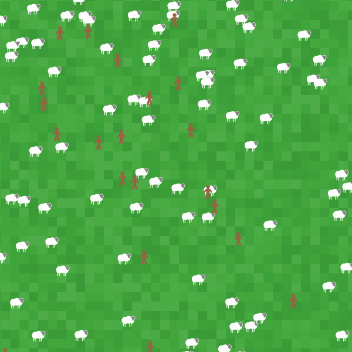

`inspect` is the built-in command to open up the inspector panel for a given agent. It is one of a few ways to open up the inspector panel, as we will discuss later. As an introduction, the inspector panel offers a quick way to view and change all the properties of a given agent (turtle, patch, link). All of the underlying information that NetLogo knows about an agent is all visible and (almost) all editable. 

To open up the inspector panel from code, use `inspect <agent>`. In practice, this often looks like `inspect turtle 0`, `inspect patch 0 0`, or `inspect one-of turtles with [color = red]`. More commonly however, you will want to open the inspector panel from the interface. To do so, right-click (or command-click for MacOS, control-click for Windows) on a given patch or a given turtle. In the list of options, there will be an option to `inspect patch <x> <y>` and, if there were any turtles under your mouse click, `turtle <number>`, which you can hover over to reveal more options, the first of which will be `inspect turtle <number>`. 

Once open, the inspector panel allows you to edit the values of almost all of the properties of an agent, both those that are built-in and defined from code using `turtles-own`, `patches-own`, `links-own`, and `<breed>-own`. For instance, you can edit the `size` of a turtle, the `pcolor` of a patch, or the shape of a link. Note that any changes are applied instantly to the specific agent that you are inspecting, but remember that if agents are being created via code in, say, a `setup` procedure, any changes you make here will not be remembered the next time all the agents are created. 